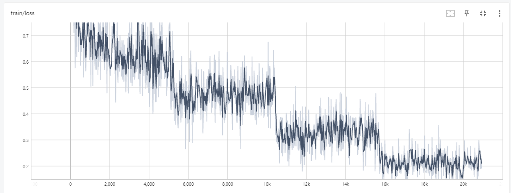

# modu-emo-classfication
본 문서는 [2023년 국립국어원 인공 지능 언어 능력 평가: 감성 분석 과제](https://corpus.korean.go.kr/taskOrdtm/taskList.do?taskOrdtmId=103&clCd=END_TASK&subMenuId=sub01)의 "사과는맛있어맛있으면바나나"팀의 모델 제작법에 관해 서술합니다.

본 제작법은 [polyglot-ko](https://huggingface.co/EleutherAI/polyglot-ko-12.8b), [llama-2-ko](https://huggingface.co/beomi/llama-2-ko-7b) 등 decoder 모델을 사용하여 다중 분류 모델 제작이 가능합니다.

[2023년 국립국어원 인공 지능 언어 능력 평가: 감성 분석 과제](https://corpus.korean.go.kr/taskOrdtm/taskList.do?taskOrdtmId=103&clCd=END_TASK&subMenuId=sub01)는 문장에서 대상에 대한 감정을 "joy", "anticipation", "trust", "surprise", "disgust", "fear", "anger", "sadness" 에서 다중 분류하는 것으로서, 사전에 아래와 같은 jsonl형식의 train,test,dev 말뭉치가 존재한다고 가정합니다. 아래 문장은 임의로 작성되었습니다.
```
#train,dev
{"id": "1", "input": {"form": "아 학교 가기 싫다.", "target": {"form": "학교", "begin": 2, "end": 4}}, "output": {"joy": "False", "anticipation": "False", "trust": "False", "surprise": "False", "disgust": "True", "fear": "False", "anger": "False", "sadness": "True"}}

#test
{"id": "1", "input": {"form": "라면 먹고싶다.", "target": {"form": "라면", "begin": 0, "end": 2}}, "output": ""}
```

## 데이터 전처리
```
python convert_data.py --input-file nikluge-ea-2023-train.jsonl --output-file train_data_clean.json
python convert_data.py --input-file nikluge-ea-2023-dev.jsonl --output-file dev_data_clean.json
python convert_data.py --input-file nikluge-ea-2023-test.jsonl --output-file test_data_clean.json
```

데이터의 "joy", "anticipation", "trust", "surprise", "disgust", "fear", "anger", "sadness"를 각각 "기쁨", "기대", "신뢰", "당황", "혐오", "공포", "분노", "슬픔"으로 전처리합니다. 이들은 [polyglot-ko](https://huggingface.co/EleutherAI/polyglot-ko-12.8b) 및 [llama-2-ko](https://huggingface.co/beomi/llama-2-ko-7b)의 tokenizer에서 1토큰으로 계산됩니다.

이때, 여러 감정이 포함된 데이터의 경우, 포함된 감정 만큼 데이터를 추가합니다. 아래는 전처리 예시입니다.

```
{
    "text": "아 학교 가기 싫다",
    "target": "학교",
    "emo": "혐오"
},
{
    "text": "아 학교 가기 싫다",
    "target": "학교",
    "emo": "슬픔"
}
```

## 학습
**자세한 학습 및 추론 코드는 [learn_polyglot-ko.ipynb](./learn_polyglot-ko.ipynb)를 참고 바랍니다.**

### 프롬프트 추가

모델의 정확도 향상을 위해 프롬프트를 사용합니다.
```python
def makedata(x):
    return {'text': f"아래는 문장에서 대상에 대한 감정을 매우 정확하게 분류한다.\n### 문장: {x['text']}\n### 대상: {x['target']}\n### 감정: {x['emo']}"}

data = data.map(
    makedata
)
```

### 마스킹

위 프롬프트에서 감정을 나타내는 단어를 제외한 모든 토큰을 loss 연산에서 제외합니다. 이는 모델 학습 시 더 정답에 집중하도록 하는 효과가 있습니다.

```python
#마스킹을 위한 기준 토큰을 설정합니다.
tokenNum_emo = 3169 #감정
tokenNum_colon = 29 #:

class maskTrainer(Trainer):
  def __init__(self, *args, **kwargs):
    super().__init__(*args, **kwargs)
  
  def compute_loss(self, model, inputs, return_outputs=False):
    # print(inputs['labels'][1])
    for x in range(len(inputs['labels'])):
      maskindex = (inputs['labels'][x]==tokenNum_emo).nonzero()[:, 0]
      temp = 0
      for i, index in enumerate(maskindex):
        if (inputs['labels'][x][index+1] != tokenNum_colon):
          maskindex = np.delete(maskindex.cpu(), i-temp)
          temp += 1
      #실제 감정을 나타내는 토큰을 제외한 모든 토큰을 마스킹 처리합니다.
      inputs['labels'][x][:maskindex[0]+2] = -100
      # print(inputs['labels'][x])
        
    outputs = model(**inputs)
    loss = outputs['loss']

    return (loss,outputs) if return_outputs else loss
```

### 설정

저희는 [polyglot-ko-12.8b](https://huggingface.co/EleutherAI/polyglot-ko-12.8b)을 추가 학습시켰습니다.

학습 비용 절약을 위해 4bit [qlora](https://github.com/artidoro/qlora)를 사용해 학습합니다. 주요 세팅은 다음과 같습니다.

- rank: 16

- alpha: 32

- target modules: "query_key_value", "dense", "dense_h_to_4h", "dense_4h_to_h"

- dropout: 0.01

- batch size: 2

- learning rate: 2e-4

- epoch: 4




## 추론

### 확률 추론

1토큰 추론 후 각 감정 토큰에 대한 logit 확률을 구합니다.

```python
import numpy as np
def gen(text="", target=""):
    inputs = tokenizer(
                f"아래는 문장에서 대상에 대한 감정을 매우 정확하게 분류한다.\n### 문장: {text}\n### 대상: {target}\n### 감정:",
                return_tensors='pt',
                return_token_type_ids=False
            )

    outputs = model.generate(
            **inputs,
            max_new_tokens=1,
            temperature=0.001,
            return_dict_in_generate=True,
            output_scores=True
        )

    emo = [6716,1321,3065,6603,11333,4993,4921,8300]
    #여기서 emo의 토큰번호는 각각 "기쁨", "기대", "신뢰", "당황", "혐오", "공포", "분노", "슬픔"에 해당합니다.
    emo_name = ["joy","anticipation","trust","surprise","disgust","fear","anger","sadness"]
    dic = []
    for tokenNum in emo:
        outputs.sequences[0][-1] = tokenNum

        transition_scores = model.compute_transition_scores(
            outputs.sequences, (outputs.scores[0].float(),), normalize_logits=True
        )

        input_length = 1 if model.config.is_encoder_decoder else inputs.input_ids.shape[1]
        generated_tokens = outputs.sequences[:, input_length:]
        dic.append(round(np.exp(transition_scores[0][0].numpy())*100,2))
    return dict(zip(emo_name,dic))
    #각 감정에 대한 확률값을 반환합니다.
gen(text="임시완의 연기 어디까지 성장할 것인가...!! 미래가 너무 기대되는 배우입니다", target="임시완의 연기")
```
```
{'joy': 52.43,
 'anticipation': 30.4,
 'trust': 16.59,
 'surprise': 0.0,
 'disgust': 0.01,
 'fear': 0.03,
 'anger': 0.01,
 'sadness': 0.05}
```

실제 언어 능력 평가에서 주어진 dev 데이터 및 test 데이터에서의 확률 추론 결과를 [dev_data_clean_predict.json](./dev_data_clean_predict.json), [test_data_clean_predict.json](./test_data_clean_predict.json)에서 확인하실 수 있습니다.


### dev 데이터를 이용한 기준 시뮬레이션

이전 단계까지 문장에서 대상에 대한 감정의 확률값을 구했지만, 몇 퍼센트 이상의 확률을 True라 표기할지의 기준이 명확하지 않습니다. 그렇기 때문에, 여기선 dev 데이터에서 추론한 결과와 정답을 비교하여 최적의 확률 기준을 탐색합니다.

```
python percent_simulation.py --predict-file dev_data_clean_predict.json --answer-file nikluge-ea-2023-dev.jsonl
```
```
...
30.0%: {'joy': 4492, 'anticipation': 4522, 'trust': 4589, 'surprise': 4660, 'disgust': 4669, 'fear': 4700, 'anger': 4667, 'sadness': 4645}
30.1%: {'joy': 4492, 'anticipation': 4522, 'trust': 4589, 'surprise': 4660, 'disgust': 4669, 'fear': 4700, 'anger': 4667, 'sadness': 4645}
30.2%: {'joy': 4492, 'anticipation': 4522, 'trust': 4589, 'surprise': 4660, 'disgust': 4669, 'fear': 4700, 'anger': 4667, 'sadness': 4646}
30.3%: {'joy': 4492, 'anticipation': 4522, 'trust': 4589, 'surprise': 4660, 'disgust': 4668, 'fear': 4700, 'anger': 4667, 'sadness': 4646}
30.4%: {'joy': 4492, 'anticipation': 4523, 'trust': 4589, 'surprise': 4660, 'disgust': 4668, 'fear': 4700, 'anger': 4667, 'sadness': 4647}
30.5%: {'joy': 4492, 'anticipation': 4522, 'trust': 4589, 'surprise': 4660, 'disgust': 4667, 'fear': 4700, 'anger': 4667, 'sadness': 4647}
30.6%: {'joy': 4492, 'anticipation': 4522, 'trust': 4589, 'surprise': 4660, 'disgust': 4668, 'fear': 4700, 'anger': 4667, 'sadness': 4647}
30.7%: {'joy': 4493, 'anticipation': 4522, 'trust': 4589, 'surprise': 4660, 'disgust': 4668, 'fear': 4700, 'anger': 4667, 'sadness': 4647}
30.8%: {'joy': 4493, 'anticipation': 4522, 'trust': 4589, 'surprise': 4660, 'disgust': 4667, 'fear': 4700, 'anger': 4668, 'sadness': 4647}
30.9%: {'joy': 4493, 'anticipation': 4522, 'trust': 4590, 'surprise': 4660, 'disgust': 4667, 'fear': 4700, 'anger': 4668, 'sadness': 4647}
31.0%: {'joy': 4494, 'anticipation': 4522, 'trust': 4590, 'surprise': 4660, 'disgust': 4667, 'fear': 4700, 'anger': 4668, 'sadness': 4647}
31.1%: {'joy': 4494, 'anticipation': 4522, 'trust': 4590, 'surprise': 4660, 'disgust': 4668, 'fear': 4700, 'anger': 4668, 'sadness': 4646}
31.2%: {'joy': 4494, 'anticipation': 4523, 'trust': 4590, 'surprise': 4660, 'disgust': 4668, 'fear': 4700, 'anger': 4668, 'sadness': 4646}
31.3%: {'joy': 4496, 'anticipation': 4523, 'trust': 4588, 'surprise': 4660, 'disgust': 4667, 'fear': 4700, 'anger': 4668, 'sadness': 4646}
...
```
percent_simulation.py는 0.0%~99.9%에서 해당 %를 확률 기준으로 한 각 감정별 TP+TN 값을 출력합니다. 이를 통해 감정별로 최적화된 확률 기준을 찾을 수 있습니다.

polyglot-ko-12.8b를 기반으로 학습된 저희 모델의 경우 그 기준은 다음과 같습니다.
```
point = {
    "joy":33.1,     #TP+TN:4498
    "anticipation": 18.4, #TP+TN:4532
    "trust":35.7, #TP+TN:4593
    "surprise":21.0, #TP+TN:4661
    "disgust":26.5,  #TP+TN:4672
    "fear":56.4, #TP+TN:4704
    "anger":35.2,  #TP+TN:4670
    "sadness":50.8  #TP+TN:4650
}
```

## 결과 병합

찾은 확률 기준으로 [merge_predict.py](./merge_predict.py)를 수정 후 실행합니다.
```
python merge_predict.py --test_file nikluge-ea-2023-test.jsonl --predict-file test_data_clean_predict.json --output-file nikluge-ea-2023-test_predict.jsonl
```